# 라온

### "즐거운"이라는 뜻의 우리말

 

# 👨‍👩‍👦‍👦 팀원 역할 및 소개

| Frontend | 역할 | 담당             |
| -------- | ---- | ---------------- |
| 정준혁   | 팀장 | 페이지 구성, API 연결 |
| 서인덕   | FE-Leader | 전역 데이터 흐름 제어 |

| Backend | 역할 | 담당             |
| ------- | ---- | ---------------- |
| 고재원  | BE-Leader | Web Socket 멀티 플레이 |
| 박영서  | Full Stack | Web Socket 멀티 플레이, 퀴즈 랭킹 조회 |
| 하재우  | Backend | Spring Security + JWT |
| 김태현  | Backend/Infra | 퀴즈 랭킹 조회, 사용자 정보 입력 및 학교 검색 |

## 🇰🇷 서비스 개요

> 어린이를 위한 국어 능력 증진 프로그램

**_국어 능력이 부족한 어린이들이 놀이를 통해 자연스럽게 학습할 수 있도록 돕는 서비스입니다._**

## ✨ 핵심 기능

> ### 🌈 맞춤법 놀이  
>
> **`평소에 몰랐거나 햇갈리던 맞춤법을 퀴즈로 재미있게!`**  

> ### ❄ 국어사전 놀이  
>
> **`단어의 의미를 퀴즈를 통해 재미있게 배울 수 있어요!`**   > **`동서남북 퀴즈를 하며 사고력을 길러요!`**

> ### ⭐ 순위  
>
> **`전국에서 혹은 교내에서 내가 몇등인지 확인해요!`**   > **`친구들과 함께하며 즐겨요!`**

> ### 🏗 인프라 구조  
>
> 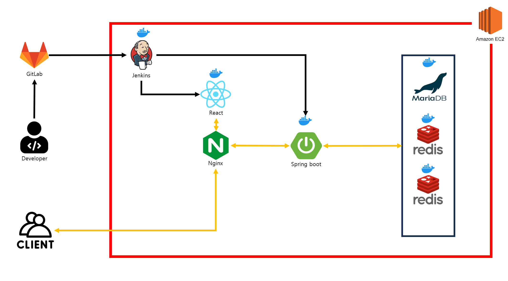

## 🛠️ 기술 스택

### Front-end

    
    
    
    
    

### Back-end

    
    
    
    
    

### Infra

    
    
    
    
    

### DB

    
    

### Project Management

    
    
    
    
    

 

## 🎬 시나리오

1. 최초에는 초기 화면으로 이동하게 됩니다.

   로그인은 `카카오` 로 진행할 수 있습니다.

<table>
    <tr align="center">
        <td><B>스플래시</B></td>
        <td><B>메인 페이지</B></td>
    </tr>
    <tr align="center">
        <td>
            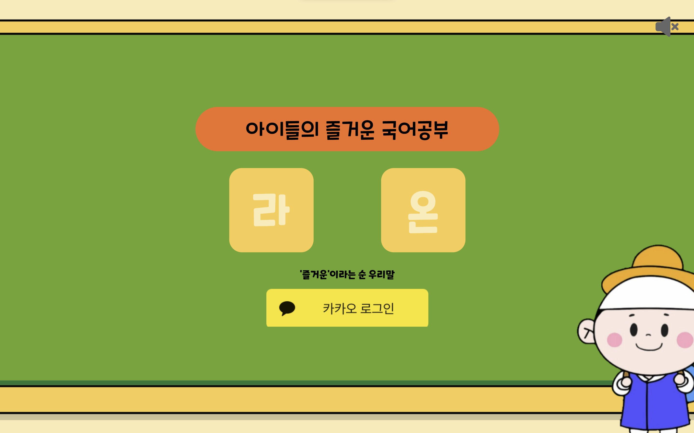
        </td>
        <td>
            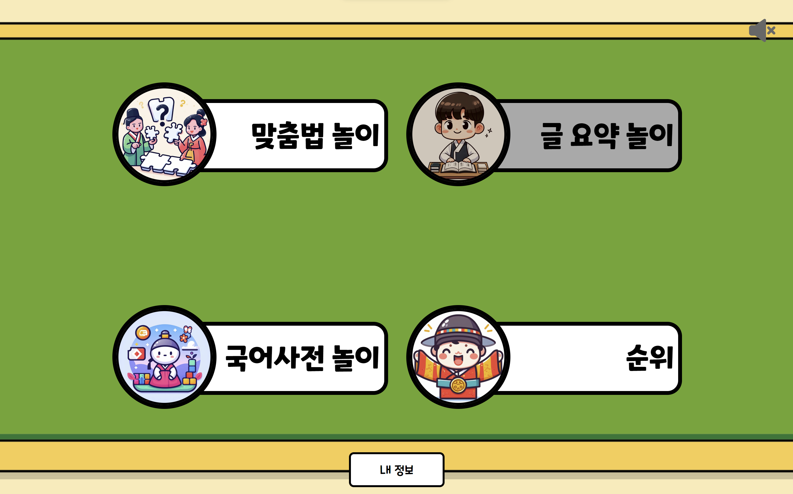
        </td>
    </tr>
</table>

2.  맞춤법 놀이는 빈칸에 들어갈 알맞은 말을 고르는 놀이입니다.

    한 문제를 풀 때마다 정답 여부와 해당 문제의 난이도를 보여줍니다.

    난이도는 정답율에 기반하여 산정됩니다.

    총 10문제를 풀고 나서 점수와 결과를 확인할 수 있습니다.

<table>
    <tr align="center">
        <td><B>문제 풀기</B></td>
        <td><B>정답 여부 확인</B></td>
        <td><B>최종 점수 확인</B></td>
    </tr>
    <tr align="center">
        <td>
            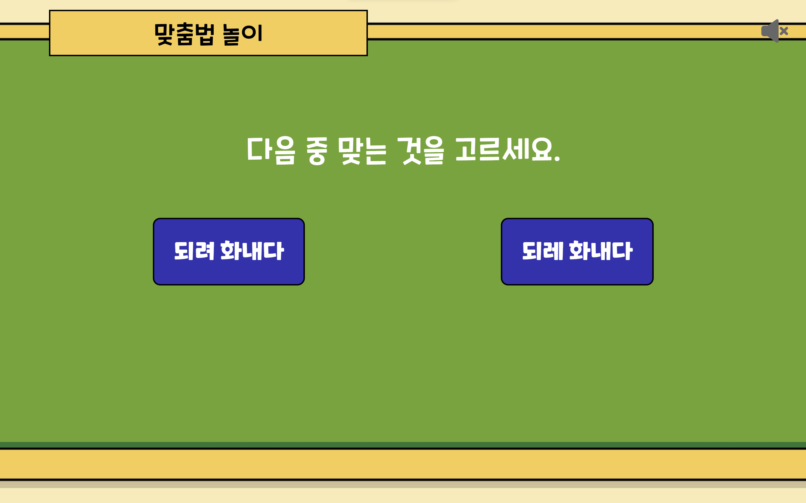
        </td>
        <td>
            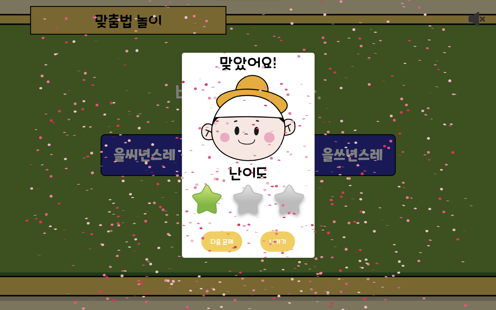
        </td>
        <td>
            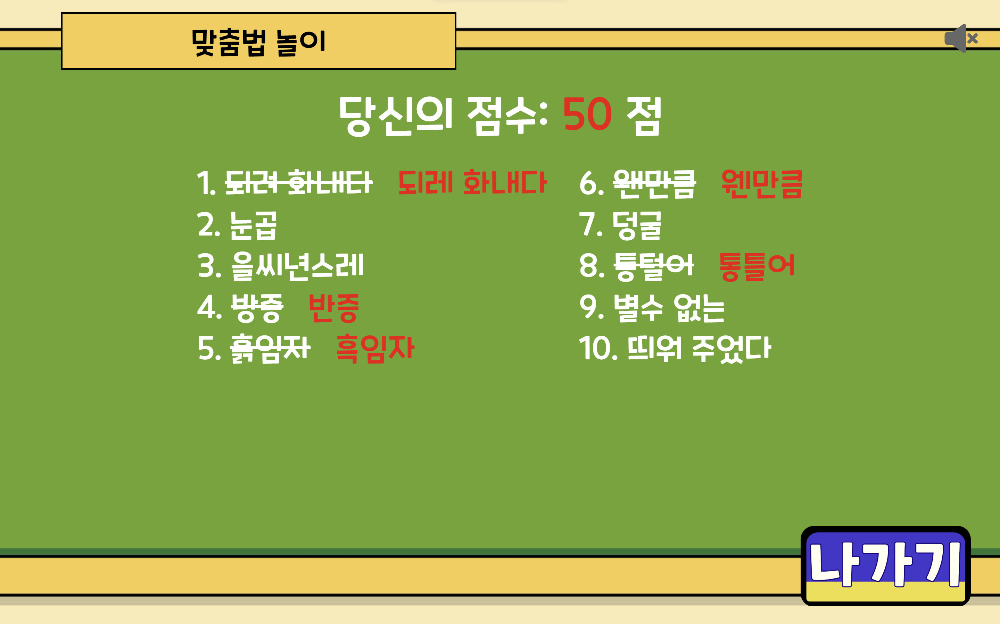
        </td>
    </tr>
</table>

3.  국어사전 놀이는 두가지 놀이를 제공합니다.

    단어의 의미와 초성을 보고 정답을 입력하거나,

    위, 아래, 왼쪽, 오른쪽 모두 단어가 될 수 있도록 하는 글자를 입력할 수 있습니다.

<table>
    <tr align="center">
        <td><B>모드 선택</B></td>
        <td><B>사전 퀴즈</B></td>
        <td><B>동서남북 퀴즈</B></td>
    </tr>
    <tr align="center">
        <td>
            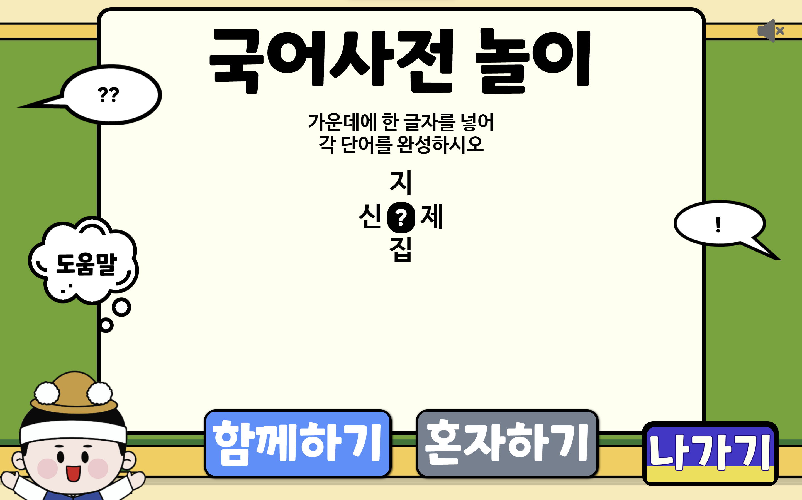
        </td>
        <td>
            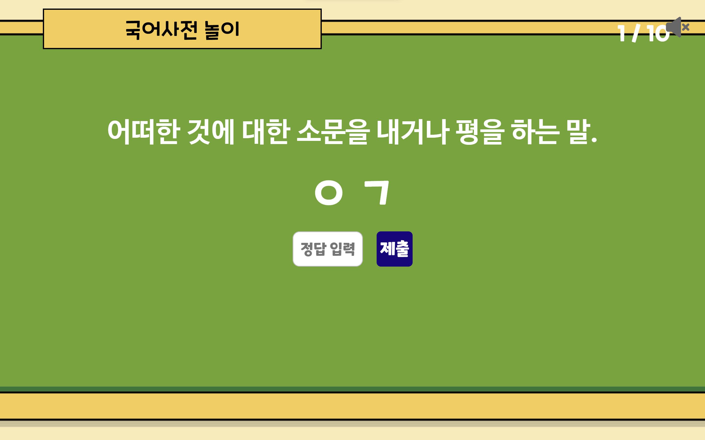
        </td>
        <td>
            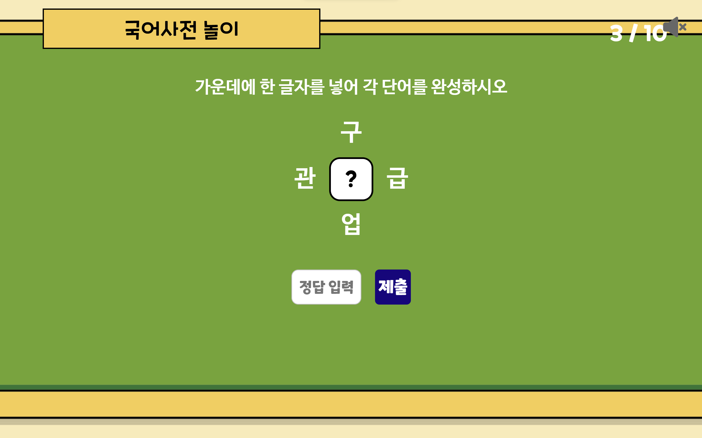
        </td>
    </tr>
</table>

4.  멀티 플레이는 친구와 경쟁을 하며 놀이를 즐길 수 있습니다.

    방 코드는 카카오톡으로 공유할 수 있으며,

    정답을 가장 빨리 맞춘 플레이어에게 제일 높은 점수가 부여됩니다.

<table>
    <tr align="center">
        <td><B>방 생성</B></td>
        <td><B>대기 방</B></td>
        <td><B>중간 결과</B></td>
        <td><B>최종 결과</B></td>
    </tr>
    <tr align="center">
        <td>
            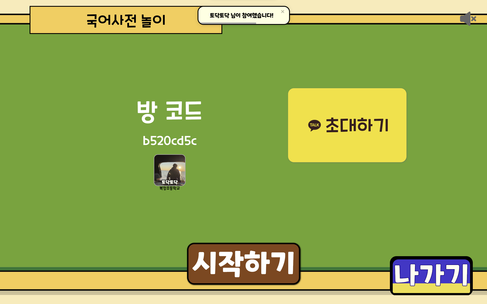
        </td>
        <td>
            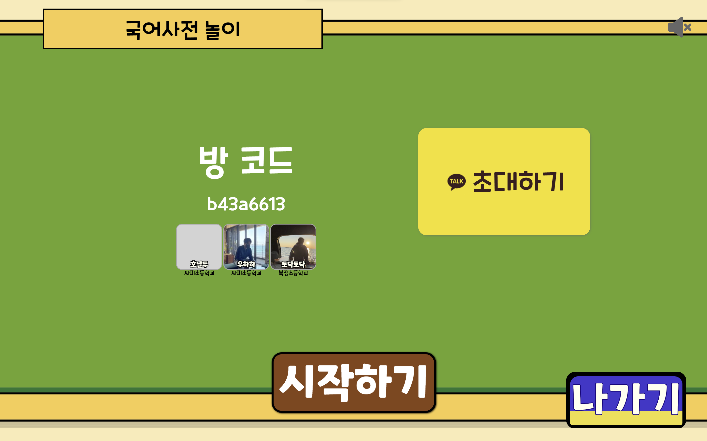
        </td>
        <td>
            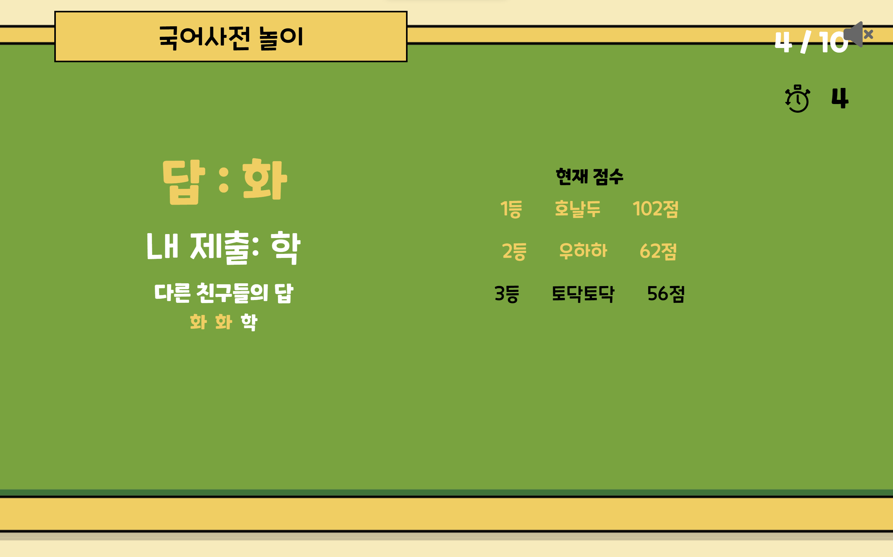
        </td>
        <td>
            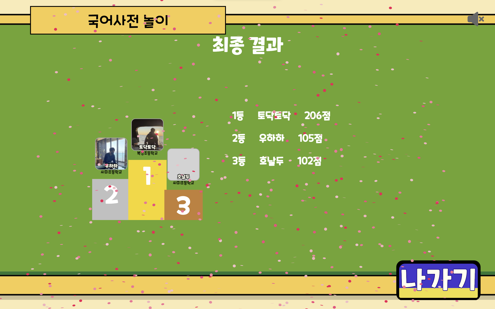
        </td>
    </tr>
</table>

5.  순위를 확인하며 친구와 재미있게 경쟁할 수 있으며,

    내 정보를 변경할 수 있습니다.

<table>
    <tr align="center">
        <td><B>순위</B></td>
        <td><B>내 정보</B></td>
    </tr>
    <tr align="center">
        <td>
            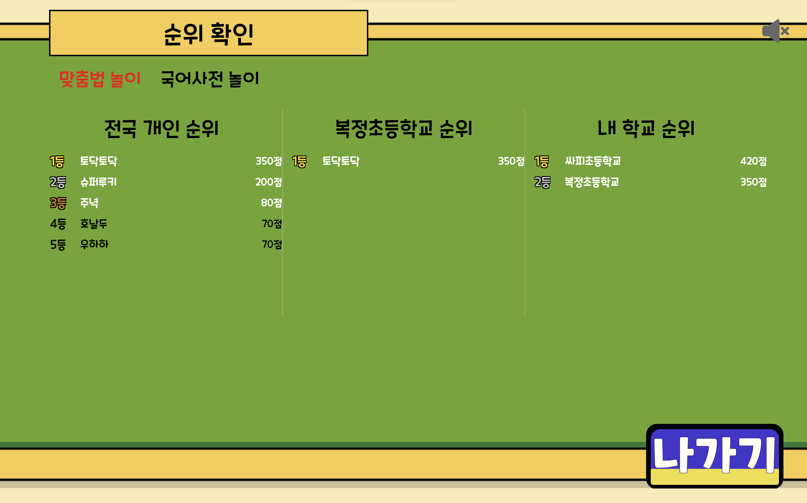
        </td>
        <td>
            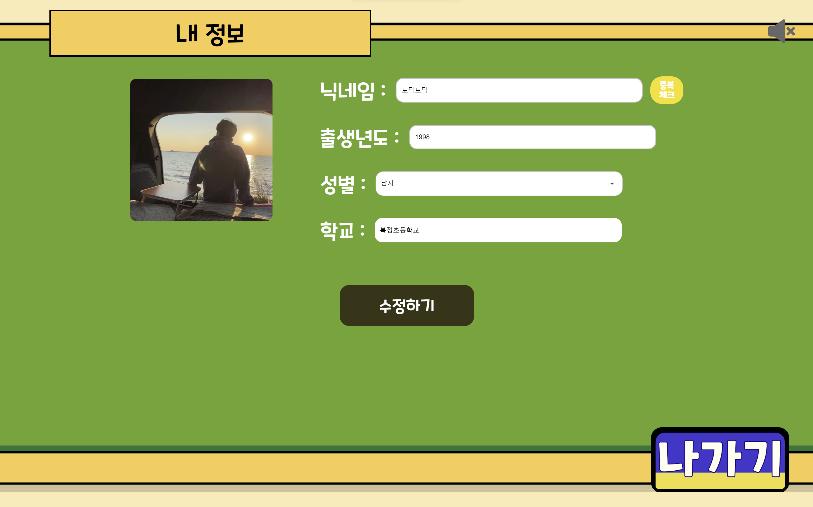
        </td>
    </tr>
</table>
