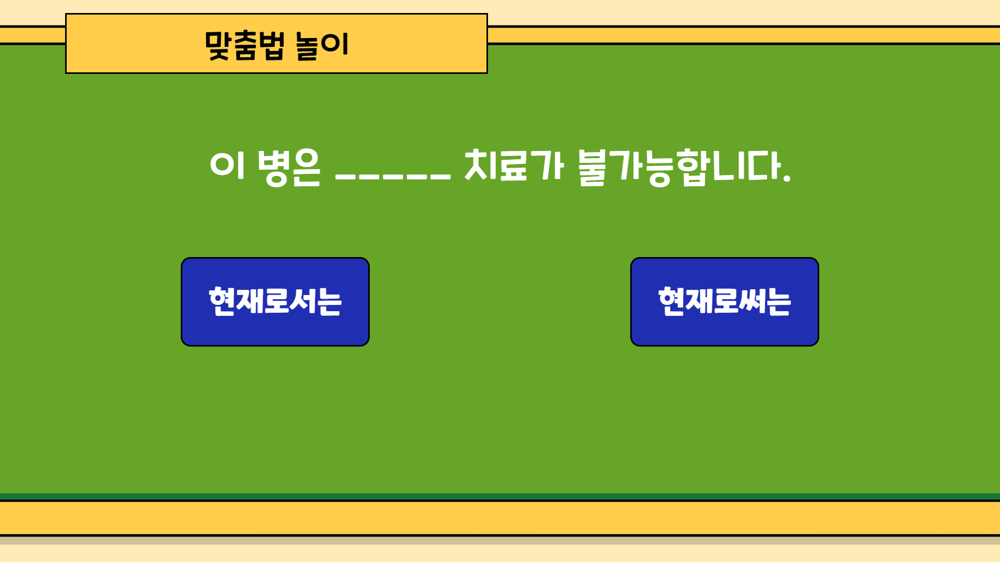
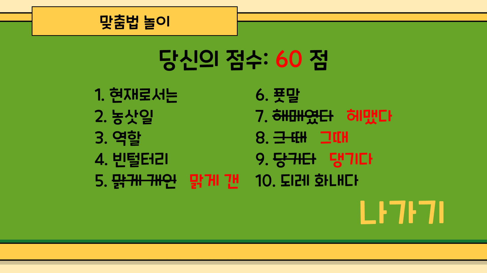

# 라온

### "즐거운"이라는 뜻의 우리말

 

# 👨‍👩‍👦‍👦 팀원 역할 및 소개

| Frontend | 역할 | 담당             |
| -------- | ---- | ---------------- |
| 정준혁   | 팀장 | 여기에 내용 작성 |
| 서인덕   | 팀원 | 여기에 내용 작성 |

| Backend | 역할 | 담당             |
| ------- | ---- | ---------------- |
| 고재원  | 팀원 | 여기에 내용 작성 |
| 박영서  | 팀원 | 여기에 내용 작성 |
| 하재우  | 팀원 | 여기에 내용 작성 |
| 김태현  | 팀원 | 여기에 내용 작성 |

## 🇰🇷 서비스 개요

> 어린이를 위한 국어 능력 증진 프로그램

**_국어 능력이 부족한 어린이들이 놀이를 통해 자연스럽게 학습할 수 있도록 돕는 서비스입니다._**

## ✨ 핵심 기능

> ### 🌈 맞춤법 놀이  
>
> **`평소에 몰랐거나 햇갈리던 맞춤법을 퀴즈로 재미있게!`**  

> ### ❄ 국어사전 놀이  
>
> **`단어의 의미를 퀴즈를 통해 재미있게 배울 수 있어요!`**   > **`동서남북 퀴즈를 하며 사고력을 길러요!`**

> ### ⭐ 순위  
>
> **`전국에서 혹은 교내에서 내가 몇등인지 확인해요!`**   > **`친구들과 함께하며 즐겨요!`**

> ### 🏗 인프라 구조  
>
> 

## 🛠️ 기술 스택

### Front-end

    
    
    
    
    

### Back-end

    
    
    
    
    

### Infra

    
    
    
    
    

### DB

    
    

### Project Management

    
    
    
    
    

 

## 🎬 시나리오

<table>
    <tr align="center">
        <td><B>스플래시</B></td>
    </tr>
    <tr align="center">
        <td>
            
        </td>
    </tr>
</table>

### 맞춤법 놀이

빈칸에 들어갈 알맞은 말을 고르는 놀이입니다.

한 문제를 풀 때마다 정답 여부와 해당 문제의 난이도를 보여줍니다.
난이도는 정답율에 기반하여 산정됩니다.

총 10문제를 풀고 나서 점수와 결과를 확인할 수 있습니다.

### 국어사전 놀이

국어사전 놀이는 혼자서 플레이 하거나 웹소켓 기반으로 친구들과 함께 플레이할 수 있습니다.
카카오톡 공유 기능을 통해 방 코드를 공유하여 초대합니다.

국어사전 놀이에는 두 가지 유형의 문제가 등장합니다.
첫 번째 유형의 문제는 초성 퀴즈입니다.

두 번째 유형의 문제는 동서남북 퀴즈입니다.
가운데에 한 글자를 넣어 각 단어를 완성하면 됩니다.

### 순위

## 아키텍쳐

