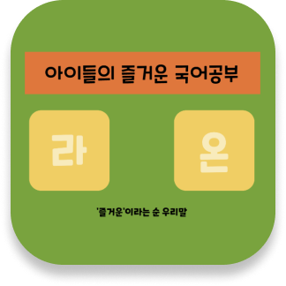

### 🧑‍🏫 라온 🇰🇷

아이들을 위한 놀이를 통한 국어 학습 게임 웹 앱 서비스

#### Overview

> 💡 SNS의 발달과 코로나 이후 아이들의 국어 능력이 저하되고 있습니다. <ins>**_라온_** 은 "즐거운"이라는 우리말</ins>로 친구들과 함께하는 놀이를 통해 국어를 자연스럽게 학습할 수 있도록 돕는 서비스입니다.

## Project Info

🗓️ 2023. 10. 10 ~ 2023. 11. 17. (총 6주)

🏆 프로젝트 우수상, 베스트 멤버 선정

👨‍👩‍👦‍👦 Member

| Backend | 역할          | 담당                                          |
| ------- | ------------- | --------------------------------------------- |
| 고재원  | BE-Leader     | Web Socket 멀티 플레이                        |
| 박영서  | Full Stack    | Web Socket 멀티 플레이, 퀴즈 랭킹 조회        |
| 하재우  | Backend       | Spring Security + JWT                         |
| 김태현  | Backend/Infra | 퀴즈 랭킹 조회, 사용자 정보 입력 및 학교 검색 |

| Frontend | 역할      | 담당                  |
| -------- | --------- | --------------------- |
| 정준혁   | 팀장      | 페이지 구성, API 연결 |
| 서인덕   | FE-Leader | 전역 데이터 흐름 제어 |

---

 

## ⚙️ 시스템 설계

### 🤝 [A. API Document](https://www.notion.so/wooha/API-7a4886492bba444f8c4703dfbf39ea32)

  

### 📄 [B. 기능 명세서](https://wooha.notion.site/cb79ee0674c4484887e0084d4b22e47c?pvs=4)

### C. System Architecture

### D. ER-Diagram

</>

## 🛠️ Skills

#### Server

     
    
    
    
    
    

#### Database

    
    

#### Front-end

    
    
    
    
    

#### Infra

    
    
    
    
    

#### Project Management

    
    
    
    
    

 

## ⭐ Issue
### Back-end
📌 **조회 속도 향상(실시간 랭킹 조회)**

- 문제: 랭킹 시스템의 경우 실시간으로 기록을 업데이트 되어야 하고, 업데이트 되는 기간이 존재 → RDBMS 활용에 대한 의문점이 생김
- 해결: In-Memory DB인 Redis의 sorted-set을 통해 구현
- 비고: 10만개의 더미 데이터를 활용해 조회 속도를 비교해 본 결과 4배 빠른 성능이 보임을 확인

 

### Front-end
📌 **StompJS를 활용한 소켓 통신 구현**

- 문제: iframe을 통해 접근할 수 없는 문제 발생
- 원인: X-Frame-Options to DENY 설정 때문
- 해결:
    
    1) header, Socket Option 설정을 ‘sameOrigin’으로 변경하여 해결

 

## 📉 Burndown chart

  

 

## 🎬 담당 기능

1. 랭킹 구현

2. 멀티플레이 게임

 

## 💭 회고

#### 새로운 기술
> 프로젝트 과정에서 처음으로 FE를 담당했습니다. React와 Typescript 모두 처음 접해보았지만, 멀티 플레이 기능 구현이라는 목표를 가지고 노력하였습니다. 어려움이 있을 때 도와준 FE 팀원들에게 감사합니다.

#### 주변 친구들과 즐기는 서비스 개발
> 게임 서비스를 개발하면서 가장 좋았던 점은 주변 사람들과 함께 즐길 수 있었다는 점 입니다. 국어 관련 퀴즈를 풀며 몰랐던 국어 맞춤법과 단어를 알게 되어 좋았다는 소감을 들었을 때 뿌듯함을 느꼈습니다. 이 경험을 통해 사용자들에게 실질적인 도움을 줄 수 있는 서비스를 만드는 것이 얼마나 중요한지를 깨달았습니다.

📌 [최종 발표 자료](https://www.miricanvas.com/v/12lvj8y)

---

 

	
  
	

